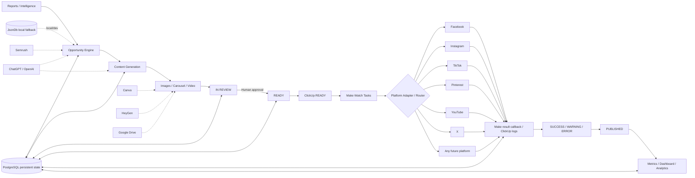

# Ghaith Web Content OS — Architecture

The storage layer is backend-agnostic through `DatabaseBackend`:

- `PostgresDb` is the production persistence path and uses a transaction plus `SELECT ... FOR UPDATE` to serialize state mutations safely.
- `JsonDb` remains available for zero-setup local development and tests.
- If `DATABASE_URL` exists, storage defaults to PostgreSQL unless `STORAGE_DRIVER=json` is explicitly set.

The default `PUBLISH_MODE=clickup_watch` mirrors the existing Ghaith Web flow. An optional `webhook` mode remains available for direct app → Make dispatch.
